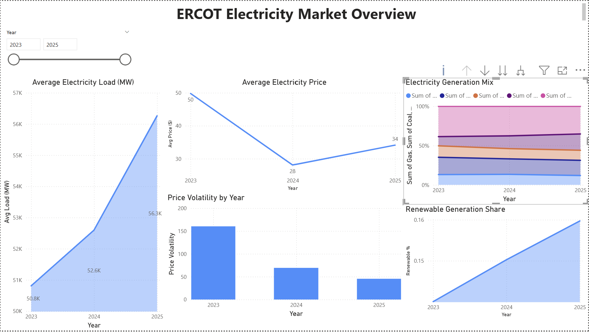
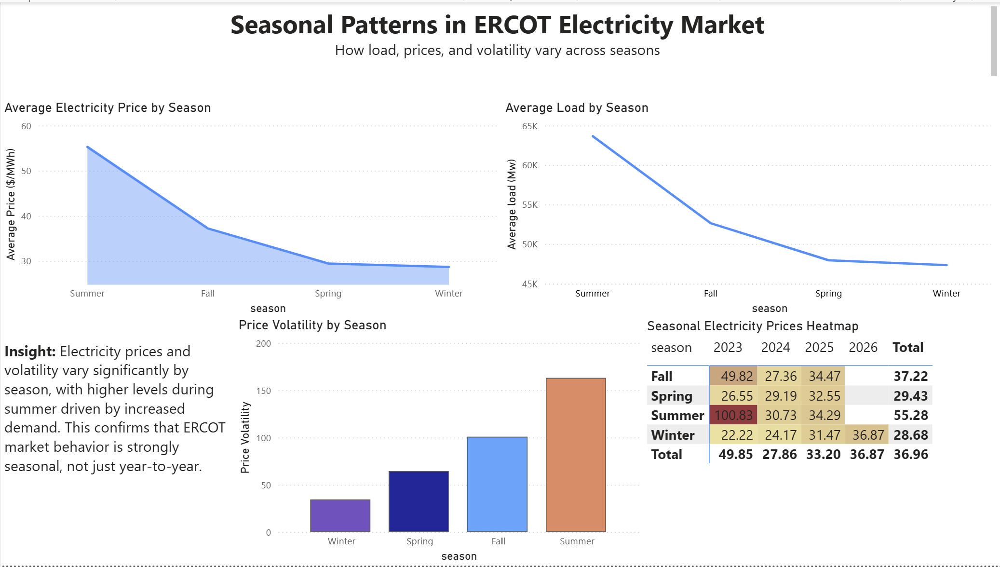

# ⚡ ERCOT Electricity Market Analysis

**End-to-end data cleaning, time-series analysis, and interactive dashboard development using Python and Power BI**

---

## 📌 Overview

This project analyzes electricity demand, pricing, and generation patterns in the ERCOT (Electric Reliability Council of Texas) market.

The objective is to transform raw ERCOT Excel datasets into clean analytical tables and build interactive dashboards to uncover:

* Demand trends over time
* Electricity price behavior and volatility
* Generation mix and renewable penetration
* Seasonal patterns and temporal dynamics

The project demonstrates a complete analytics workflow: **data engineering → time-series analysis → business intelligence dashboarding**.

---

## 🚀 Project Versions

### V1 — Market Overview Dashboard

Core data pipeline and baseline dashboard.

Features:

* Cleaned ERCOT load, price, and generation datasets
* Built monthly aggregated datasets using Python (pandas)
* Created Power BI dashboard for market overview
* Analyzed demand trends, pricing patterns, and generation mix

Outputs:

* `load_hourly_clean.csv`
* `load_monthly_clean.csv`
* `prices_monthly_clean.csv`
* `generation_monthly_clean.csv`

---

### V2 — Seasonality & Temporal Analysis

Extended analysis with deeper time-series insights and seasonal behavior.

New features:

* Seasonal trend analysis
* Monthly and cyclical demand patterns
* Price volatility analysis over time
* Enhanced Power BI dashboard
* Improved data pipeline and notebook structure

This version demonstrates stronger time-series reasoning and analytical maturity.

---

## 🗂 Repository Structure

```text
Ercot-electricity-market-analysis/

├── notebooks/
│   ├── ercot_data_cleaning_v1.ipynb
│   └── ercot_data_cleaning_v2_seasonality.ipynb
│
├── powerbi/
│   ├── ERCOT_Electricity_Market_Analysis_v1.pbix
│   └── ERCOT_Electricity_Market_Analysis_v2_seasonality.pbix
│
├── data/
│   └── processed/
│       ├── load_hourly_clean.csv
│       ├── load_monthly_clean.csv
│       ├── prices_monthly_clean.csv
│       └── generation_monthly_clean.csv
│
├── visuals/
│   ├── dashboard_overview_v1.png
│   └── dashboard_overview_v2_seasonality.png
│
└── README.md
```

---

## 🛠 Tech Stack

**Programming**

* Python
* pandas
* numpy

**Data Analysis**

* Time-series aggregation
* Feature engineering
* Statistical analysis

**Visualization**

* Power BI
* Interactive dashboards
* Time-series visualization

**Data Sources**

* ERCOT public market data
* Native load reports
* Settlement point price reports
* Generation by fuel reports

---

## 📊 Key Analytical Components

### Data Engineering

* Multi-file Excel ingestion
* Data cleaning and validation
* Schema standardization
* Feature engineering
* Monthly and hourly aggregation

### Time-Series Analysis

* Demand trend analysis
* Seasonal pattern detection
* Price volatility measurement
* Renewable generation analysis

### Dashboard Development

* Interactive Power BI dashboards
* Time-based filtering
* KPI visualization
* Executive-level analytical presentation

---

## 📈 Dashboard Preview

### V1 — Market Overview



### V2 — Seasonality Analysis



---

## 📦 How to Use

### Run notebook

Open in:

* Google Colab
  or
* Jupyter Notebook

Upload ERCOT Excel files when prompted.

Outputs will be generated as CSV files ready for Power BI.

---

### Open dashboard

Open `.pbix` files in:

Power BI Desktop

---

## 🎯 Skills Demonstrated

This project demonstrates real-world data science and analytics skills:

* Data cleaning and preprocessing
* Time-series analysis
* Feature engineering
* Data pipeline development
* Business intelligence dashboarding
* Analytical storytelling
* Versioned project development

---

## 🔮 Future Improvements

Potential extensions:

* Electricity demand forecasting (ARIMA, Prophet)
* Weather-demand correlation analysis
* Automated ETL pipeline
* Real-time dashboard integration
* Advanced statistical modeling

---

## ⭐ Why This Project Matters

Electricity markets are highly dynamic and driven by demand, generation, and seasonal factors. This project demonstrates the ability to:

* Work with real-world energy market data
* Build production-ready analytical pipelines
* Extract meaningful insights from complex datasets
* Present results using professional dashboards

---

